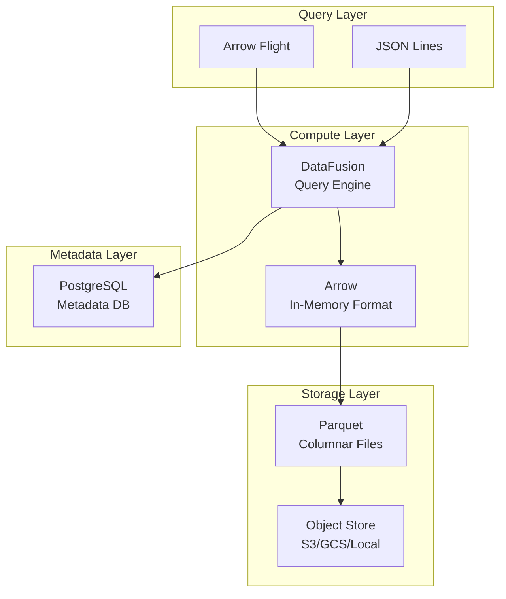
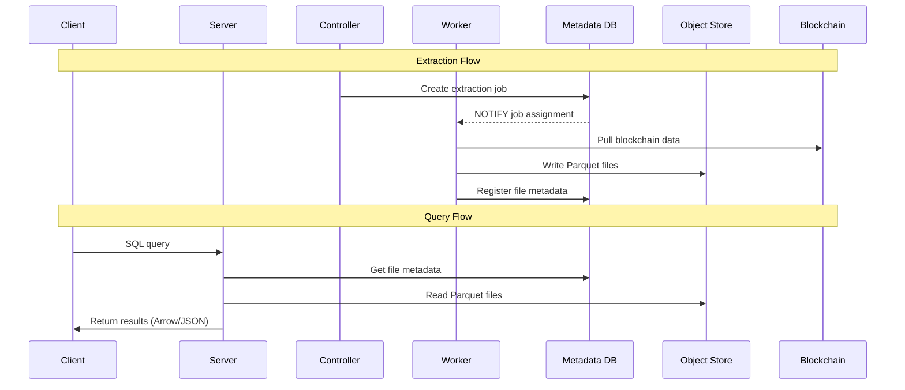
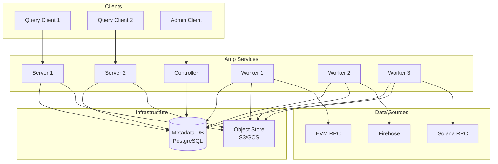

## Overview

Amp is a high-performance ETL (Extract, Transform, Load) architecture for blockchain data services. It focuses on extracting blockchain data from various sources, transforming it via SQL queries, and serving it through multiple query interfaces.

The system is built using a modern data infrastructure stack optimized for analytical workloads over blockchain data:

- **Language**: Rust
- **Query Engine**: Apache DataFusion
- **Storage Format**: Apache Parquet
- **Wire Format**: Apache Arrow
- **Metadata Database**: PostgreSQL

## Key Components

Amp's architecture consists of several core components that can be deployed independently or together depending on your needs.

### Main Binary (`ampd`)

The central command dispatcher with multiple operational modes:

| Command | Description | Use Case |
|---------|-------------|----------|
| `solo` | All-in-one development mode | Local development and testing |
| `server` | Query server (Flight + JSONL) | Serving SQL queries to clients |
| `worker` | Data extraction worker | Distributed data ingestion |
| `controller` | Admin API and job scheduling | Management and orchestration |
| `migrate` | Database schema migrations | Metadata database setup |

<Info>
  In production, you'll typically run `server`, `worker`, and `controller` as separate processes for resource isolation and horizontal scaling. For local development, `solo` mode combines everything into a single process.
</Info>

### Server Component

The server provides query access through two endpoints:

**Arrow Flight Server** (default port 1602)
- High-performance binary protocol using gRPC
- Streaming query support
- Apache Arrow format for efficient data transfer
- Best for high-throughput analytical queries

**JSON Lines Server** (default port 1603)
- Simple HTTP POST interface
- Returns newline-delimited JSON (NDJSON)
- Compression support (gzip, brotli, deflate)
- Best for ease of integration and debugging

Both servers execute SQL queries via DataFusion and can handle:
- Batch queries (one-shot execution)
- Streaming queries (continuous updates as new blocks arrive)
- Complex SQL operations (joins, aggregations, window functions)

### Worker Component

Workers execute blockchain data extraction jobs:

- Register with metadata database using a unique node ID
- Maintain heartbeat every 1 second
- Listen for job assignments via PostgreSQL LISTEN/NOTIFY
- Pull data from blockchain sources (RPC, Firehose, etc.)
- Write Parquet files to object storage
- Update job progress in metadata database
- Support graceful restart and job resumption

Multiple workers can run in parallel for horizontal scaling of data extraction.

### Controller Component

The controller provides the Admin API (default port 1610) for:

- Dataset lifecycle management (register, deploy, inspect)
- Job control (start, stop, monitor extraction jobs)
- Worker health monitoring and coordination
- Manifest versioning and tagging
- File metadata inspection

<Warning>
  The Admin API should be deployed in a private network and **never exposed to the public internet**. It provides administrative capabilities that require strict access control.
</Warning>

## Technology Stack

Amp leverages the FDAP stack for high-performance analytical queries:

### FDAP Stack Components

**Flight** - Arrow Flight protocol provides high-performance data transfer over gRPC with native support for streaming and parallelism.

**DataFusion** - Query engine that provides SQL execution and optimization. It handles query planning, predicate pushdown, and distributed execution.

**Arrow** - In-memory columnar format that enables efficient processing with minimal data movement and maximal parallelism.

**Parquet** - On-disk columnar format with compression and encoding optimized for analytical queries. Parquet files include statistics for query pruning.

### Core Libraries

**`common`**
- Shared utilities and abstractions
- Configuration management
- EVM-specific UDFs (User-Defined Functions)
- Catalog management for dataset registration

**`metadata-db`**
- PostgreSQL-based metadata storage
- Tracks file metadata, worker nodes, job scheduling
- Uses LISTEN/NOTIFY for distributed coordination
- Row-level locking for concurrent access

**`data-store`**
- Dataset and table revision management
- Parquet metadata caching (in-memory, memory-weighted eviction)
- Object store abstraction layer
- File registration and lifecycle tracking

**`dataset-store`**
- Dataset manifest parsing and validation
- SQL dataset support (derived datasets)
- JavaScript UDF support for custom transformations

## Component Interaction

The following diagram illustrates how components interact during a typical query and extraction workflow:

## Deployment Modes

Amp supports two primary deployment patterns:

### Single-Node Mode (Development)

Using `ampd solo`, all components run in a single process:
- Combined server (Flight + JSONL)
- Embedded controller (Admin API)
- Single worker thread
- Shared configuration and logging

**When to use:**
- Local development and testing
- CI/CD pipelines
- Quick prototyping
- Learning Amp capabilities

<Warning>
  Single-node mode is **not recommended for production** due to lack of resource isolation and fault tolerance.
</Warning>

### Distributed Mode (Production)

Separate processes for server, worker, and controller:
- Multiple servers for query load balancing
- Multiple workers for parallel extraction
- Single controller for centralized management
- Coordination via shared metadata database

**When to use:**
- Production deployments
- Resource isolation (CPU/memory for queries vs extraction)
- Horizontal scaling requirements
- High availability
- Multi-region deployments

## Storage Architecture

Amp uses a dual-storage architecture:

**Object Store** (S3, GCS, or local filesystem)
- Stores actual Parquet data files
- Organized by dataset → table → revision → files
- Immutable, append-only model
- Supports unlimited storage capacity

**Metadata Database** (PostgreSQL)
- Tracks file locations and statistics
- Manages table revisions and active pointers
- Coordinates worker assignments and job status
- Stores dataset manifests and version tags
- Caches Parquet footers for fast query planning

<Info>
  The metadata database enables fast query planning without scanning object storage. Parquet metadata is cached in-memory with memory-weighted eviction for optimal performance.
</Info>

## Configuration

Amp uses a hierarchical configuration system:

### Configuration Sources (in order of precedence)

1. **Environment variables**: `AMP_CONFIG_*` (use double underscore for nested values)
2. **Config file**: TOML file specified via `AMP_CONFIG` or `--config`
3. **Defaults**: Built-in default values

### Key Configuration Directories

| Directory | Purpose | Contains |
|-----------|---------|----------|
| `manifests_dir` | Dataset definitions | Manifest JSON files |
| `providers_dir` | Data source configs | Provider TOML files |
| `data_dir` | Parquet storage | Output data files |

### Object Store Support

Amp supports multiple storage backends:
- Local filesystem (development)
- S3-compatible stores (AWS S3, MinIO, etc.)
- Google Cloud Storage (GCS)
- Azure Blob Storage

## Related Documentation

<CardGroup cols={2}>
  <Card title="Data Flow" icon="arrow-right" href="/concepts/data-flow">
    Learn about Amp's ETL pipeline and data processing flow
  </Card>
  <Card title="Datasets" icon="database" href="/concepts/datasets">
    Understand dataset manifests, tables, and revisions
  </Card>
  <Card title="Providers" icon="plug" href="/concepts/providers">
    Explore data provider configuration and blockchain sources
  </Card>
  <Card title="Operational Modes" icon="gear" href="/deployment/modes">
    Detailed deployment patterns and scaling strategies
  </Card>
</CardGroup>