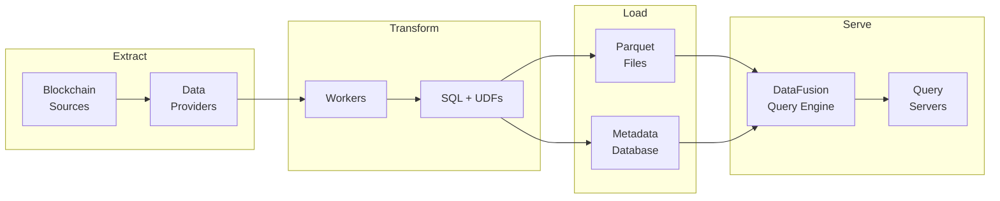
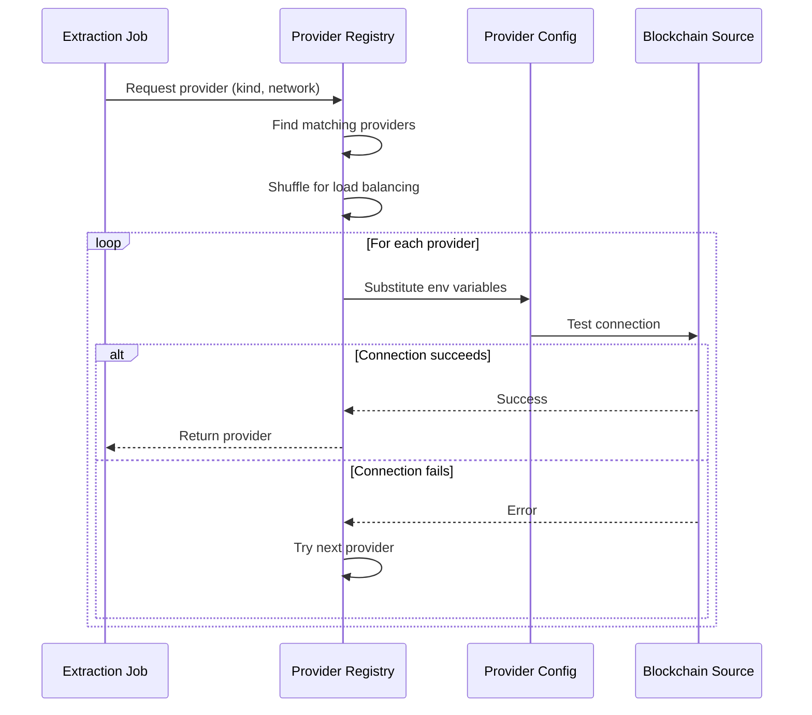
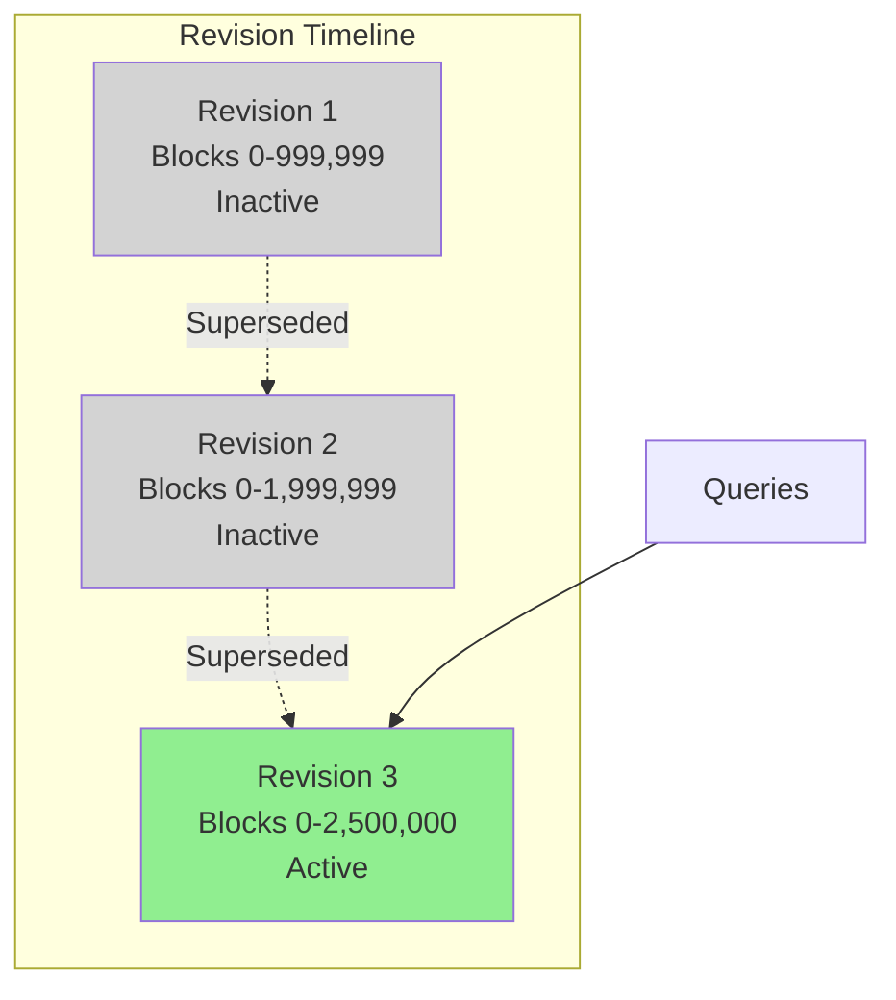
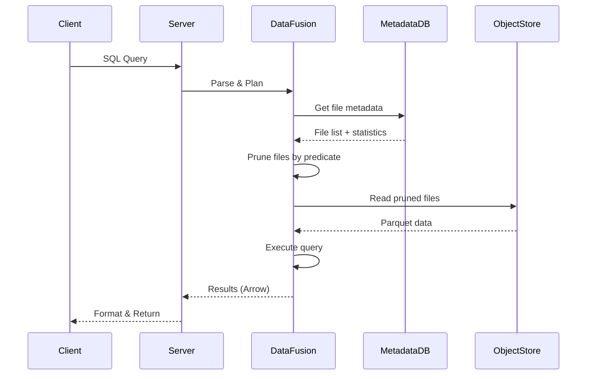

## Overview

Amp implements a complete ETL (Extract, Transform, Load) pipeline for blockchain data:

1. **Extract**: Pull data from blockchain sources (EVM RPC, Firehose, Solana)
2. **Transform**: Process data using SQL queries with custom UDFs
3. **Store**: Save as Parquet files in columnar format optimized for analytics
4. **Serve**: Provide query interfaces (Arrow Flight gRPC, JSON Lines HTTP)



## Extract Phase

### Data Sources

Amp extracts blockchain data from multiple source types:

**EVM RPC** - Ethereum-compatible JSON-RPC endpoints
- Connects to standard JSON-RPC APIs (HTTP/WebSocket/IPC)
- Batched requests for efficiency
- Configurable rate limiting and concurrency
- Tables: blocks, transactions, logs

**Firehose** - StreamingFast's high-throughput gRPC protocol
- Real-time blockchain data streaming via gRPC
- Protocol buffer-based binary format
- Includes full call traces
- Tables: blocks, transactions, logs, calls

**Solana** - Solana blockchain via RPC and Old Faithful archive
- Historical data from Old Faithful CAR files (~745GB per epoch)
- Real-time data via JSON-RPC endpoints
- Slot-based architecture with gap handling
- Tables: block_headers, transactions, messages, instructions

### Provider Resolution

Providers decouple dataset definitions from concrete data sources:



**Provider matching criteria:**
- `kind` (e.g., "evm-rpc", "firehose", "solana")
- `network` (e.g., "mainnet", "base", "polygon")

**Benefits:**
- Multiple datasets can share the same provider
- Switch endpoints without modifying datasets
- Random selection among matching providers for load balancing
- Credentials isolated from dataset definitions

### Data Extraction

Workers pull data from blockchain sources using configured providers:

1. **Job Assignment** - Worker receives job from controller via PostgreSQL NOTIFY
2. **Provider Setup** - Resolve and connect to appropriate data provider
3. **Block Range Processing** - Stream blocks within assigned range
4. **Data Normalization** - Convert blockchain-specific formats to Arrow schemas
5. **Batching** - Accumulate records for efficient Parquet writing

<Info>
  Workers maintain heartbeats every 1 second and support graceful restart. Jobs automatically resume from the last committed block.
</Info>

## Transform Phase

### Raw Datasets

Raw datasets extract blockchain data directly from providers with minimal transformation:

- Schema defined by provider type (EVM, Firehose, Solana)
- Data written as-is to Parquet files
- Block range-based partitioning
- No custom SQL transformations

**Example raw dataset tables (EVM RPC):**
```
blocks:
  - block_num (partitioning key)
  - hash, parent_hash, timestamp
  - miner, gas_used, gas_limit
  
transactions:
  - block_num (partitioning key)
  - tx_index, hash, from, to
  - value, gas, gas_price, input
  
logs:
  - block_num (partitioning key)
  - tx_index, log_index, address
  - topics, data
```

### Derived Datasets

Derived datasets use SQL queries to transform raw data:

- Reference other datasets as data sources
- Apply custom SQL transformations
- Use built-in UDFs for blockchain-specific operations
- Support JavaScript UDFs for custom logic

**Example derived dataset:**
```sql
-- Extract USDC Transfer events from logs
SELECT 
  block_num,
  tx_hash,
  evm_hex_decode(topics[1]) as from_address,
  evm_hex_decode(topics[2]) as to_address,
  evm_uint256_decode(data) as amount
FROM 'ethereum/mainnet'.logs
WHERE address = '0xa0b86991c6218b36c1d19d4a2e9eb0ce3606eb48'
  AND topics[0] = '0xddf252ad1be2c89b69c2b068fc378daa952ba7f163c4a11628f55a4df523b3ef'
```

### Built-in User-Defined Functions (UDFs)

Amp provides EVM-specific UDFs for common blockchain operations:

**Hex Encoding/Decoding**
- `evm_hex_encode()` - Convert bytes to hex string
- `evm_hex_decode()` - Convert hex string to bytes

**Type Conversions**
- `evm_uint256_decode()` - Decode 256-bit unsigned integers
- `evm_int256_decode()` - Decode 256-bit signed integers
- `evm_address_decode()` - Extract Ethereum addresses

**Units**
- `evm_wei_to_eth()` - Convert wei to ETH
- `evm_eth_to_wei()` - Convert ETH to wei
- `evm_gwei_to_wei()` - Convert gwei to wei

**Log Parsing**
- `evm_log_topics()` - Extract log topics array
- `evm_log_data()` - Extract log data field

**Parameters**
- `evm_decode_params()` - Decode function parameters by ABI

<Tip>
  UDFs enable complex blockchain data transformations directly in SQL without external processing.
</Tip>

## Load Phase

### Parquet File Storage

Transformed data is written to Parquet files with optimized layout:

**File Naming Convention:**
```
{block_num:09}-{suffix:016x}.parquet
```
- `block_num`: Starting block number (9 digits, zero-padded)
- `suffix`: Random 16-character hex value for uniqueness

**Example:**
```
000000000-a1b2c3d4e5f67890.parquet  # blocks 0-14,999
000015000-f7e8d9c0b1a29384.parquet  # blocks 15,000-29,999
```

**File Properties:**
- Columnar storage format (Parquet)
- Compression (typically Snappy or ZSTD)
- Embedded statistics (min/max/null count per column)
- Page indices for efficient filtering
- Immutable (write-once, never modified)

### Storage Hierarchy

Parquet files are organized in object storage:

```
<base_url>/
└── <dataset_namespace>/<dataset_name>/
    └── <table_name>/
        └── <revision_uuid>/              # UUIDv7, temporally ordered
            ├── 000000000-xxxx.parquet
            ├── 000015000-yyyy.parquet
            └── ...
```

**Example path:**
```
s3://amp-data-lake/ethereum/mainnet/logs/01930eaf-67e5-7b5e-80b0-8d3f2a5c4e1b/000000000-a1b2c3d4e5f67890.parquet
```

**Storage layers:**

| Level | Identifier | Cardinality | Mutability |
|-------|-----------|-------------|------------|
| Base | Object store URL | One per deployment | Configuration |
| Dataset | `namespace/name` | Many per deployment | Immutable identifier |
| Table | `table_name` | Many per dataset | Defined in manifest |
| Revision | UUIDv7 | Many per table, one active | Immutable snapshot |
| File | `{block:09}-{suffix:016x}.parquet` | Many per revision | Write-once |

### Metadata Registration

As workers write Parquet files, they register metadata in PostgreSQL:

**Registered metadata:**
- File name and full URL in object storage
- Object metadata: size, etag, version
- Parquet footer bytes (including page indices)
- Computed statistics for query optimization

**Benefits:**
- Fast query planning without object store access
- Predicate pushdown using file statistics
- In-memory caching of Parquet metadata
- Efficient file pruning during queries

### Table Revisions

Tables use an immutable revision model:

- **New data creates new revisions** (never modifies existing)
- **UUIDv7 provides temporal ordering** (newer = lexicographically greater)
- **Single active revision** per table serves queries
- **Retained revisions** enable point-in-time recovery
- **Atomic switches** between revisions (single metadata update)



<Info>
  Queries always read from the active revision. Writers create new revisions while readers access existing ones, eliminating read-write contention.
</Info>

## Serve Phase

### Query Planning

When a client submits a SQL query:

1. **Parse SQL** - DataFusion parses and validates the query
2. **Resolve Datasets** - Identify referenced datasets and their tables
3. **Get File Metadata** - Retrieve file list and statistics from metadata DB
4. **Prune Files** - Use predicate pushdown to skip irrelevant files
5. **Create Execution Plan** - Generate optimized physical plan
6. **Execute** - Stream data from Parquet files via object store



### Predicate Pushdown

DataFusion automatically optimizes queries using Parquet statistics:

**Example query:**
```sql
SELECT * FROM 'ethereum/mainnet'.logs 
WHERE block_num BETWEEN 1000000 AND 2000000
  AND address = '0xa0b86991c6218b36c1d19d4a2e9eb0ce3606eb48'
```

**Optimization steps:**
1. **Block range filter** - Only read files with blocks 1M-2M using filename patterns
2. **Address filter** - Skip files where `address` column min/max stats don't match
3. **Row group pruning** - Within files, skip row groups that don't match
4. **Page-level filtering** - Use page indices for fine-grained filtering

<Tip>
  Proper partitioning by `block_num` and column statistics enable queries to skip 90%+ of data in many cases.
</Tip>

### Query Execution Modes

**Batch Queries** (default)
- One-shot execution against current data
- Returns complete result set
- Supports all SQL operations (aggregations, ORDER BY, LIMIT)
- Best for ad-hoc analysis and reports

**Streaming Queries**
- Continuous execution as new blocks arrive
- Emits incremental results (microbatches)
- Limited to incrementalizable operations (filters, projections, simple joins)
- Best for real-time monitoring and alerting

```sql
-- Batch query (default)
SELECT COUNT(*) FROM 'ethereum/mainnet'.blocks
WHERE block_num > 19000000

-- Streaming query
SELECT block_num, hash, timestamp 
FROM 'ethereum/mainnet'.blocks
WHERE block_num > 19000000
SETTINGS stream = true
```

### Transport Formats

**Arrow Flight** (port 1602)
- Binary protocol over gRPC
- Zero-copy data transfer
- Streaming support built-in
- Best for high-throughput workloads

**JSON Lines** (port 1603)
- HTTP POST with NDJSON response
- Newline-delimited JSON records
- Compression support (gzip, brotli, deflate)
- Best for debugging and simple integrations

## End-to-End Example

A complete flow from blockchain source to query result:

### 1. Dataset Deployment

```bash
# Register a dataset manifest
ampctl dataset register ethereum/mainnet ./manifest.json --tag 1.0.0

# Deploy for extraction (start job)
ampctl dataset deploy ethereum/mainnet@1.0.0
```

### 2. Data Extraction (Worker)

```
1. Worker receives job notification
2. Resolves provider: kind=evm-rpc, network=mainnet
3. Connects to RPC endpoint (e.g., Alchemy)
4. Pulls blocks 0-1,000,000
5. Writes Parquet files:
   - s3://data/ethereum/mainnet/blocks/<revision>/000000000-*.parquet
   - s3://data/ethereum/mainnet/transactions/<revision>/000000000-*.parquet
   - s3://data/ethereum/mainnet/logs/<revision>/000000000-*.parquet
6. Registers file metadata in PostgreSQL
7. Updates job progress
```

### 3. Query Execution (Server)

```bash
# Client sends query via JSON Lines
curl -X POST http://localhost:1603/query/jsonl \
  -d "SELECT block_num, hash FROM 'ethereum/mainnet'.blocks WHERE block_num < 100"
```

```
1. Server receives SQL query
2. DataFusion parses query
3. Resolves 'ethereum/mainnet'.blocks table
4. Queries metadata DB for files
5. Prunes files by block_num < 100 predicate
6. Reads relevant Parquet files from S3
7. Applies filters and projections
8. Formats results as NDJSON
9. Returns to client
```

### 4. Client Receives Results

```json
{"block_num": 0, "hash": "0xd4e56740f876aef8c010b86a40d5f56745a118d0906a34e69aec8c0db1cb8fa3"}
{"block_num": 1, "hash": "0x88e96d4537bea4d9c05d12549907b32561d3bf31f45aae734cdc119f13406cb6"}
{"block_num": 2, "hash": "0xb495a1d7e6663152ae92708da4843337b958146015a2802f4193a410044698c9"}
...
```

## Performance Characteristics

**Extraction Throughput:**
- EVM RPC: 100-1,000 blocks/sec (depends on RPC endpoint)
- Firehose: 10,000+ blocks/sec (gRPC streaming)
- Solana: Varies by archive vs RPC mode

**Query Performance:**
- Predicate pushdown reduces I/O by 90%+ in typical cases
- Columnar format enables efficient projection
- Parquet compression reduces storage costs 5-10x vs raw JSON
- In-memory metadata caching eliminates cold-start latency

**Scalability:**
- Horizontal scaling: Add more workers for extraction
- Vertical scaling: More CPU/memory for query servers
- Storage: Unlimited via object stores (S3/GCS)
- Metadata DB: PostgreSQL handles millions of files

## Related Documentation

<CardGroup cols={2}>
  <Card title="Architecture" icon="sitemap" href="/concepts/architecture">
    Understand system components and technology stack
  </Card>
  <Card title="Datasets" icon="database" href="/concepts/datasets">
    Learn about dataset manifests, tables, and schemas
  </Card>
  <Card title="Providers" icon="plug" href="/concepts/providers">
    Configure blockchain data source connections
  </Card>
  <Card title="Querying Data" icon="magnifying-glass" href="/guides/querying">
    Write SQL queries with UDFs and optimization tips
  </Card>
</CardGroup>