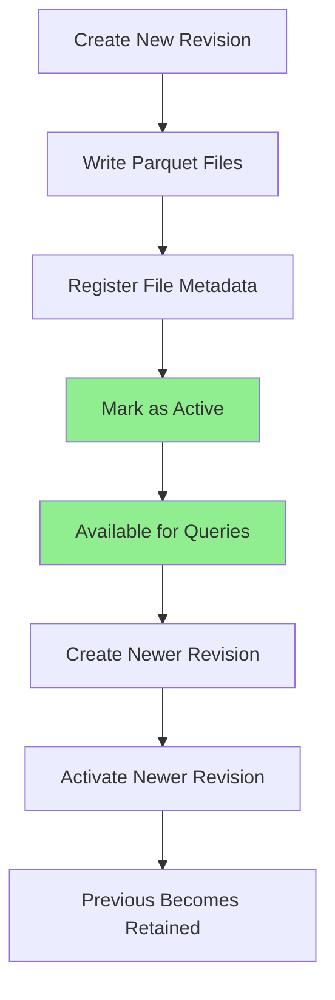
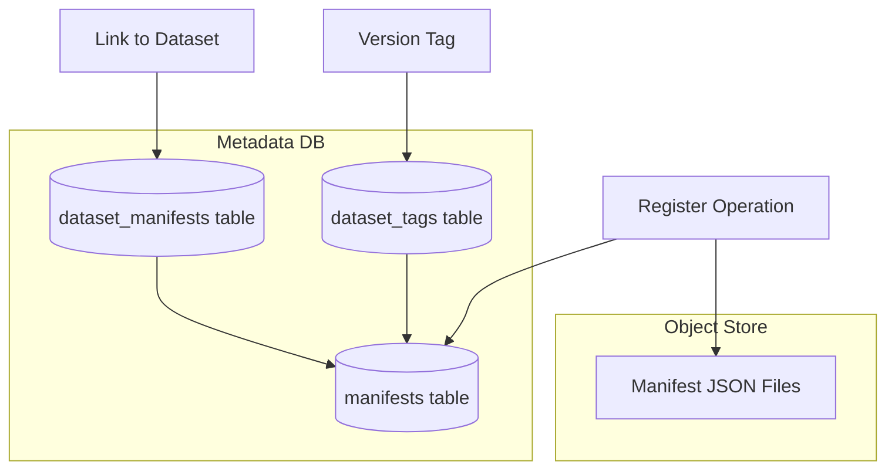

## Overview

Datasets are the fundamental organizing unit in Amp. A dataset defines:

- **Schema**: Tables, columns, and data types
- **Source**: Where data comes from (provider reference or SQL query)
- **Configuration**: Extraction parameters, partitioning, sort order
- **Version**: Semantic versioning and tags for lifecycle management

Datasets are defined in **manifest files** (JSON documents) that describe how to extract, transform, and organize blockchain data.

## Dataset Types

Amp supports two types of datasets:

### Raw Datasets

**Raw datasets** extract blockchain data directly from providers with minimal transformation. The schema is determined by the provider type.

**Characteristics:**
- Data extracted directly from blockchain sources
- Schema defined by provider (evm-rpc, firehose, solana)
- No custom SQL transformations
- Tables written as-is to Parquet files

**Example use cases:**
- Complete blockchain history (all blocks, transactions, logs)
- Foundation for derived datasets
- Archival storage of raw blockchain data

**Supported provider types:**

| Provider | Tables | Description |
|----------|--------|-------------|
| `evm-rpc` | blocks, transactions, logs | EVM chains via JSON-RPC |
| `firehose` | blocks, transactions, logs, calls | EVM chains via Firehose gRPC |
| `solana` | block_headers, transactions, messages, instructions | Solana via RPC + Old Faithful |

### Derived Datasets

**Derived datasets** use SQL queries to transform data from other datasets. They enable data enrichment, filtering, and custom schemas.

**Characteristics:**
- Reference other datasets as data sources
- Custom SQL transformations
- Use built-in UDFs for blockchain operations
- Support JavaScript UDFs for custom logic

**Example use cases:**
- Extract specific smart contract events (ERC-20 transfers)
- Decode transaction parameters by ABI
- Aggregate data across multiple blocks
- Join data from multiple datasets

**Example SQL transformation:**
```sql
-- Extract USDC Transfer events
SELECT 
  block_num,
  tx_hash,
  evm_hex_decode(topics[1]) as from_address,
  evm_hex_decode(topics[2]) as to_address,
  evm_uint256_decode(data) as amount,
  timestamp
FROM 'ethereum/mainnet'.logs
WHERE address = '0xa0b86991c6218b36c1d19d4a2e9eb0ce3606eb48'
  AND topics[0] = '0xddf252ad1be2c89b69c2b068fc378daa952ba7f163c4a11628f55a4df523b3ef'
```

<Info>
  Derived datasets are particularly powerful for creating application-specific views of blockchain data without maintaining custom indexers.
</Info>

## Dataset Manifests

Manifests are JSON documents that fully describe a dataset. They are **content-addressable** (identified by SHA-256 hash) and **immutable**.

### Manifest Structure

A typical manifest contains:

```json
{
  "name": "mainnet",
  "namespace": "ethereum",
  "kind": "evm-rpc",
  "network": "mainnet",
  "start_block": 0,
  "finalized_blocks_only": true,
  "tables": [
    {
      "name": "blocks",
      "schema": [...],
      "sort_by": ["block_num"],
      "partition_by": ["block_num"]
    },
    {
      "name": "transactions",
      "schema": [...],
      "sort_by": ["block_num", "tx_index"],
      "partition_by": ["block_num"]
    },
    {
      "name": "logs",
      "schema": [...],
      "sort_by": ["block_num", "tx_index", "log_index"],
      "partition_by": ["block_num"]
    }
  ]
}
```

### Manifest Fields

**Dataset identification:**
- `namespace`: Organizational grouping (e.g., "ethereum", "polygon")
- `name`: Dataset name (e.g., "mainnet", "usdc-transfers")
- `kind`: Dataset type ("evm-rpc", "firehose", "solana", "sql")

**Data source configuration:**
- `network`: Blockchain network identifier (for provider matching)
- `start_block`: First block to extract (default: 0)
- `finalized_blocks_only`: Only extract finalized blocks (default: false)

**Table definitions:**
- `tables`: Array of table schemas
  - `name`: Table name
  - `schema`: Column definitions (name, type, nullable)
  - `sort_by`: Columns to sort by (affects query performance)
  - `partition_by`: Partitioning columns (typically block_num)

### Content-Addressable Storage

Manifests are stored using their content hash:

```
SHA-256(manifest_json) → 8a3f9c1d...
```

**Benefits:**
- **Deduplication**: Identical manifests stored once
- **Integrity**: Hash verifies content hasn't changed
- **Versioning**: Different versions have different hashes
- **Immutability**: Cannot modify existing manifests

<Tip>
  Manifests are stored in object storage (S3/GCS) with metadata tracked in PostgreSQL. The Dataset Registry manages manifest lifecycle and version tags.
</Tip>

## Dataset Versioning

Datasets support semantic versioning and special tags:

### Version Tags

Three types of version tags:

**Semantic Versions** (e.g., `1.0.0`, `2.1.3`)
- Explicit version numbers set by users
- Follow semver conventions
- Immutable once created

**`latest` Tag**
- Automatically points to highest semantic version
- Updated when new semantic version is tagged
- Recommended for production deployments

**`dev` Tag**
- Points to most recently linked manifest
- Updated on every registration (with or without semantic version)
- Used for development and testing

### Version Management Example

```bash
# Register manifest without semantic version (updates "dev" only)
ampctl dataset register ethereum/mainnet ./manifest.json
# → dev: 8a3f9c1d...

# Register with semantic version (updates "dev" and "1.0.0", sets "latest")
ampctl dataset register ethereum/mainnet ./manifest-v1.json --tag 1.0.0
# → dev: 5b2e7a3c...
# → 1.0.0: 5b2e7a3c...
# → latest: 5b2e7a3c... (points to 1.0.0)

# Register newer version
ampctl dataset register ethereum/mainnet ./manifest-v2.json --tag 2.0.0
# → dev: 9f4d8e1a...
# → 2.0.0: 9f4d8e1a...
# → latest: 9f4d8e1a... (now points to 2.0.0)
# → 1.0.0: 5b2e7a3c... (unchanged, still accessible)
```

### Referencing Datasets

Datasets are referenced using the format:

```
namespace/name@version
```

**Examples:**
```sql
-- Reference latest version
SELECT * FROM 'ethereum/mainnet@latest'.blocks

-- Reference specific version
SELECT * FROM 'ethereum/mainnet@1.0.0'.blocks

-- Reference dev version
SELECT * FROM 'ethereum/mainnet@dev'.blocks

-- Implicit latest (version omitted)
SELECT * FROM 'ethereum/mainnet'.blocks
```

## Tables and Schemas

### Table Structure

Each table in a dataset has:

**Schema** - Column definitions:
```json
{
  "name": "block_num",
  "type": "UInt64",
  "nullable": false
}
```

**Sort Order** - Columns to sort by:
```json
"sort_by": ["block_num", "tx_index"]
```
Sorting improves query performance by enabling efficient range scans.

**Partitioning** - How data is divided:
```json
"partition_by": ["block_num"]
```
Partitioning by `block_num` enables file pruning based on block ranges.

### Common Schema Patterns

**EVM Blocks Table:**
```
block_num: UInt64 (partition key, sort key)
hash: String
parent_hash: String
timestamp: Timestamp
miner: String
gas_used: UInt64
gas_limit: UInt64
base_fee_per_gas: UInt64
```

**EVM Logs Table:**
```
block_num: UInt64 (partition key, sort key)
tx_index: UInt32 (sort key)
log_index: UInt32 (sort key)
address: String
topics: List<String>
data: String
tx_hash: String
```

<Info>
  All tables should include `block_num` for efficient querying and partitioning. This is the primary dimension for filtering blockchain data.
</Info>

## Table Revisions

Tables use an **immutable revision model** for data storage:

### Key Concepts

**Revision** - An immutable snapshot of a table's data at a point in time:
- Identified by UUIDv7 (temporally ordered)
- Contains zero or more Parquet files
- Lives at unique path in object storage
- Never modified after creation

**Active Revision** - The single revision currently used for queries:
- Only one revision is active per table
- Queries always read from active revision
- Previous revisions retained but not queried

**Revision Path Structure:**
```
<dataset_namespace>/<dataset_name>/<table_name>/<revision_uuid>/
```

### Revision Lifecycle



**Creation:**
1. Generate new UUIDv7
2. Construct storage path: `<dataset>/<table>/<uuid>/`
3. Register in metadata database
4. Lock to writer job

**Population:**
1. Worker writes Parquet files to revision path
2. Registers each file's metadata (size, stats, footer)
3. Updates job progress

**Activation:**
1. Update table's `active_revision_id` pointer
2. Previous active revision becomes retained
3. Atomic switch (single database operation)

**Benefits:**
- **No read-write contention**: Queries read old revision while writers populate new
- **Atomic updates**: Table switches to new data in single operation
- **Point-in-time recovery**: Can revert to previous revisions
- **Concurrent writes**: Different tables can write independently

### Revision Metadata

Each revision tracks:

```
id: UUIDv7
path: dataset/table/uuid
writer: job_id (lock owner)
metadata: JSONB (informative data)
created_at: Timestamp
updated_at: Timestamp
```

The `metadata` field stores informative data for debugging:
- Dataset associated at creation time
- Schema versions
- Custom annotations

## Dataset Registry

The **Dataset Registry** manages dataset lifecycle:

### Registry Operations

**Register Manifest:**
```bash
# Store manifest in content-addressable storage
ampctl manifest register ./manifest.json
# → Manifest hash: 8a3f9c1d2e5b7a9f...

# Link manifest to dataset with version tag
ampctl dataset register ethereum/mainnet ./manifest.json --tag 1.0.0
```

**Deploy Dataset:**
```bash
# Start extraction job for continuous sync
ampctl dataset deploy ethereum/mainnet@1.0.0

# Extract specific block range
ampctl dataset deploy ethereum/mainnet@1.0.0 --end-block 5000000
```

**List Datasets:**
```bash
ampctl dataset list
```

**Inspect Dataset:**
```bash
# View dataset details and manifest
ampctl dataset inspect ethereum/mainnet@1.0.0

# Get raw manifest JSON
ampctl dataset manifest ethereum/mainnet@1.0.0
```

### Storage Architecture

The registry uses two storage layers:

**Metadata Database** (PostgreSQL):
- Stores manifest metadata and version tags
- Tracks dataset-manifest links
- Provides transactional consistency
- Enables version resolution

**Object Store** (S3/GCS/local):
- Stores actual manifest file content
- Content-addressed by hash
- Durable storage for JSON files



## Dataset Configuration

### Provider Reference (Raw Datasets)

Raw datasets specify provider matching criteria:

```json
{
  "kind": "evm-rpc",
  "network": "mainnet"
}
```

At runtime, the provider registry finds matching providers:
1. Filter by `kind` and `network`
2. Shuffle for load balancing
3. Try each until connection succeeds

### SQL Source (Derived Datasets)

Derived datasets specify SQL transformations:

```json
{
  "kind": "sql",
  "query": "SELECT ... FROM 'ethereum/mainnet'.logs WHERE ..."
}
```

### Extraction Configuration

**Block Range:**
```json
{
  "start_block": 0,
  "end_block": null  // null = continuous sync
}
```

**Finality:**
```json
{
  "finalized_blocks_only": true  // wait for finality before extracting
}
```

**Parallelism:**
```bash
# Set via deploy command
ampctl dataset deploy ethereum/mainnet@1.0.0 --parallelism 4
```

## Best Practices

### Schema Design

<Check>
  **Always partition by `block_num`** - Enables efficient file pruning and range queries
</Check>

<Check>
  **Sort by query patterns** - If you frequently filter by `address`, include it in `sort_by`
</Check>

<Check>
  **Use appropriate data types** - `UInt64` for block numbers, `String` for hashes and addresses
</Check>

### Versioning Strategy

<Check>
  **Use semantic versions for production** - Tag stable versions as `1.0.0`, `2.0.0`, etc.
</Check>

<Check>
  **Use `latest` tag for deployments** - Reference `@latest` in production queries for automatic updates
</Check>

<Check>
  **Use `dev` tag for development** - Test manifest changes with `@dev` before tagging releases
</Check>

### Performance Optimization

<Tip>
  Derived datasets inherit partitioning from source tables. Filter on `block_num` in SQL to maintain efficient pruning.
</Tip>

<Tip>
  Use UDFs for blockchain-specific operations instead of external processing. This keeps transformations close to data.
</Tip>

## Related Documentation

<CardGroup cols={2}>
  <Card title="Architecture" icon="sitemap" href="/concepts/architecture">
    Understand how datasets fit into Amp's architecture
  </Card>
  <Card title="Data Flow" icon="arrow-right" href="/concepts/data-flow">
    See how datasets flow through the ETL pipeline
  </Card>
  <Card title="Providers" icon="plug" href="/concepts/providers">
    Configure data source connections for raw datasets
  </Card>
  <Card title="Creating Datasets" icon="plus" href="/guides/datasets">
    Step-by-step guide to creating and deploying datasets
  </Card>
</CardGroup>