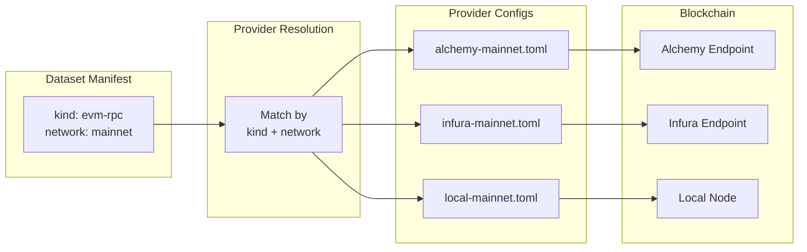
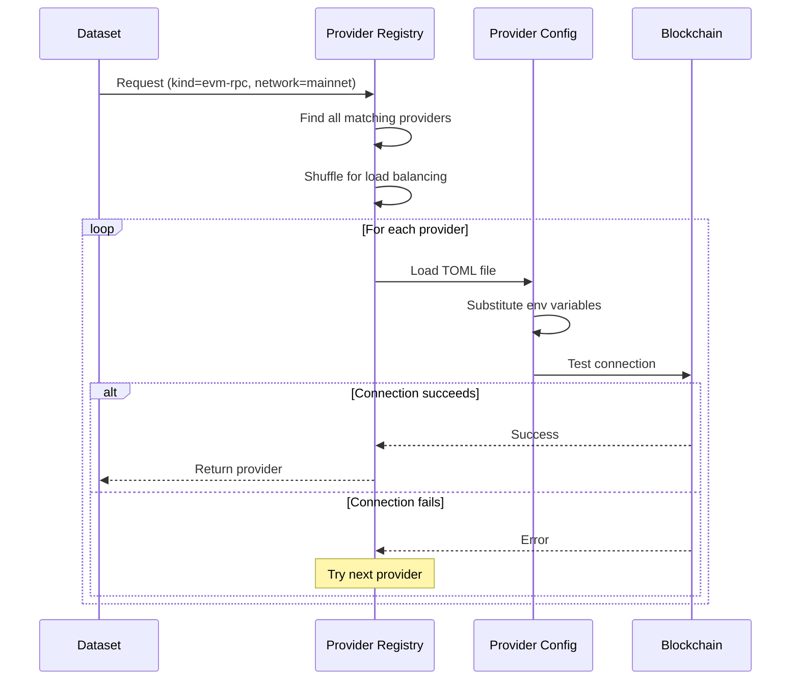
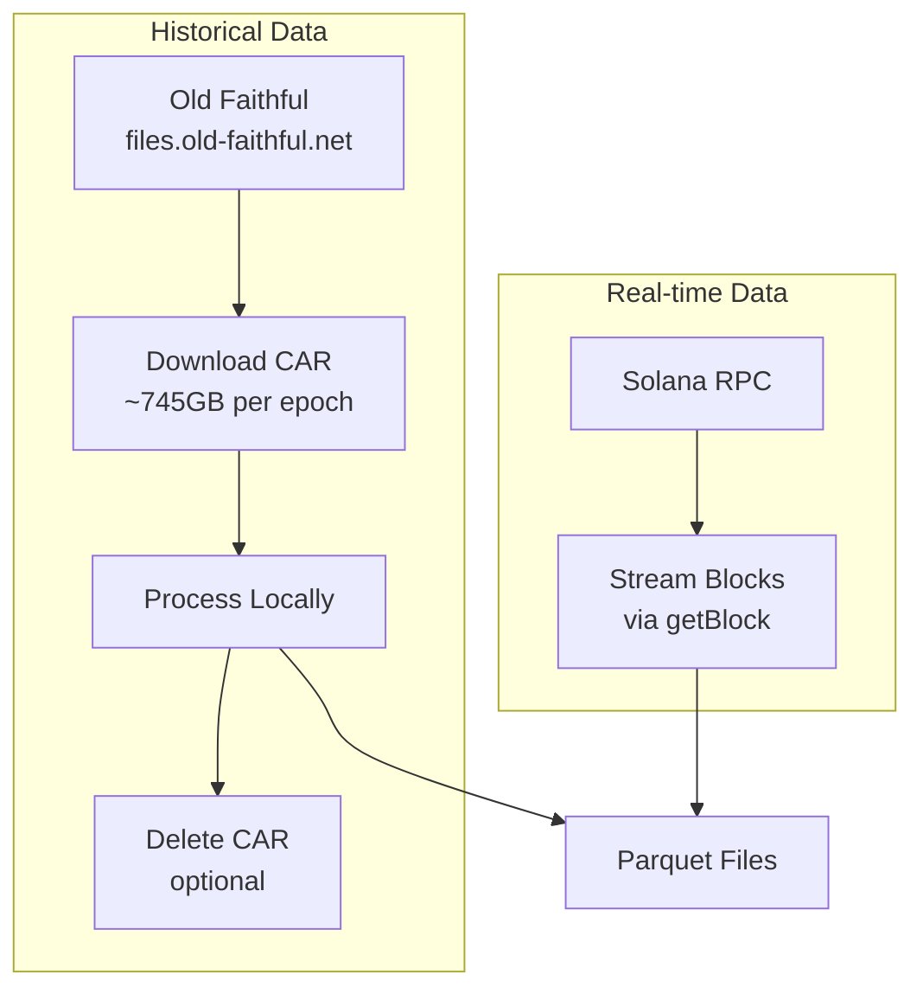

## Overview

**Providers** are external data source configurations that enable datasets to connect to blockchain networks. They abstract connection details from dataset definitions, allowing reusable, shareable configurations across multiple datasets.

The provider system supports multiple blockchain protocols:

- **EVM RPC** - Ethereum-compatible chains via JSON-RPC
- **Firehose** - High-throughput gRPC streaming from StreamingFast
- **Solana** - Solana blockchain via RPC + Old Faithful archive

## Key Concepts

### Provider Components

**Provider** - A named configuration representing a connection to a blockchain data source:
- Stored as TOML files in `providers_dir`
- Contains endpoint URLs, credentials, and connection settings
- Matched to datasets by `kind` and `network`

**Provider Kind** - The protocol type:
- `evm-rpc` - JSON-RPC for EVM-compatible chains
- `firehose` - StreamingFast Firehose gRPC protocol
- `solana` - Solana RPC with Old Faithful archive support

**Network** - The blockchain network identifier:
- `mainnet`, `goerli`, `sepolia` (Ethereum)
- `base`, `polygon`, `arbitrum`, `optimism` (L2s and other chains)
- Custom network names for private chains

**Provider Resolution** - Automatic matching process:
1. Dataset requests provider by `(kind, network)` tuple
2. System finds all matching providers
3. Providers are shuffled for load balancing
4. Environment variable substitution applied
5. First successful connection is used

### Architecture

Providers decouple dataset definitions from concrete data sources:



## Benefits of Provider System

| Benefit | Description |
|---------|-------------|
| **Reusability** | Multiple datasets share the same provider configuration |
| **Flexibility** | Switch endpoints without modifying dataset manifests |
| **Load Balancing** | Random selection among matching providers distributes load |
| **Security** | Credentials isolated from dataset definitions in environment variables |
| **Environment-Specific** | Different providers for dev/staging/production |

## Provider Resolution Flow

When a dataset needs a provider:



**Resolution steps:**

1. **Match by criteria** - Filter providers by `kind` and `network`
2. **Shuffle providers** - Randomize order for load distribution
3. **Substitute variables** - Replace `${VAR}` with environment values
4. **Test connection** - Attempt to connect to blockchain endpoint
5. **Return on success** - First successful provider is used
6. **Fail if all fail** - Error if no provider connects successfully

## Provider Types

### EVM RPC Provider

Connects to Ethereum-compatible chains via standard JSON-RPC.

**Configuration:**

```toml
# providers/alchemy-mainnet.toml
kind = "evm-rpc"
network = "mainnet"
url = "${ETH_MAINNET_RPC_URL}"

# Optional: Performance tuning
concurrent_request_limit = 512
rpc_batch_size = 100
rate_limit_per_minute = 1000
fetch_receipts_per_tx = false
```

**Fields:**

| Field | Type | Required | Description |
|-------|------|----------|-------------|
| `kind` | string | Yes | Must be `"evm-rpc"` |
| `network` | string | Yes | Network identifier (mainnet, base, polygon, etc.) |
| `url` | string | Yes | RPC endpoint URL (http/https/ws/wss/ipc) |
| `concurrent_request_limit` | number | No | Max concurrent requests (default: 1024) |
| `rpc_batch_size` | number | No | Requests per batch, 0 = disabled (default: 0) |
| `rate_limit_per_minute` | number | No | Rate limit in requests/minute |
| `fetch_receipts_per_tx` | boolean | No | Use per-tx receipt fetching (default: false) |

**Supported URL schemes:**

| Scheme | Type | Use Case |
|--------|------|----------|
| `http://`, `https://` | HTTP | Standard RPC endpoints |
| `ws://`, `wss://` | WebSocket | Persistent connections |
| `ipc://` | IPC Socket | Local node connections |

**Examples:**

```toml
# HTTP endpoint with API key
url = "https://eth-mainnet.g.alchemy.com/v2/${ALCHEMY_API_KEY}"

# WebSocket endpoint
url = "wss://eth-mainnet.g.alchemy.com/v2/${ALCHEMY_API_KEY}"

# Local IPC socket
url = "ipc:///home/user/.ethereum/geth.ipc"
```

**Receipt fetching strategies:**

**Bulk receipts** (default, `fetch_receipts_per_tx = false`):
- Uses `eth_getBlockReceipts` for all receipts at once
- Faster but requires RPC support
- Not all endpoints support this method

**Per-transaction receipts** (`fetch_receipts_per_tx = true`):
- Uses `eth_getTransactionReceipt` for each transaction
- Slower but more compatible
- Works with all standard RPC endpoints

**Extracted tables:**
- `blocks` - Block headers
- `transactions` - Transaction data
- `logs` - Event logs

<Tip>
  Enable batching (`rpc_batch_size = 100`) to reduce HTTP overhead when extracting historical data.
</Tip>

### Firehose Provider

Connects to StreamingFast's Firehose for high-throughput gRPC streaming.

**Configuration:**

```toml
# providers/firehose-mainnet.toml
kind = "firehose"
network = "mainnet"
url = "${FIREHOSE_ETH_MAINNET_URL}"

# Optional: Authentication
token = "${FIREHOSE_ETH_MAINNET_TOKEN}"
```

**Fields:**

| Field | Type | Required | Description |
|-------|------|----------|-------------|
| `kind` | string | Yes | Must be `"firehose"` |
| `network` | string | Yes | Network identifier (mainnet, base, etc.) |
| `url` | string | Yes | Firehose gRPC endpoint URL |
| `token` | string | No | Bearer token for authentication |

**Connection features:**

| Feature | Description |
|---------|-------------|
| **Gzip Compression** | Both send and receive compressed |
| **Large Messages** | Up to 100 MiB message size |
| **Auto Retry** | 5-second backoff on stream errors |
| **TLS** | Native TLS with system roots |

**Authentication:**

When a token is provided, it's sent as a bearer token:
```
authorization: bearer <token>
```

**Extracted tables:**
- `blocks` - Block header information
- `transactions` - Transaction data
- `calls` - Internal call traces (Firehose-specific)
- `logs` - Event logs

<Info>
  Firehose is significantly faster than RPC for bulk extraction due to server-side streaming and optimized binary format. It's ideal for syncing large block ranges.
</Info>

### Solana Provider

Connects to Solana blockchain using a two-stage approach: historical data from Old Faithful archive and real-time data from RPC.

**Configuration:**

```toml
# providers/solana-mainnet.toml
kind = "solana"
network = "mainnet"
rpc_provider_url = "${SOLANA_MAINNET_RPC_URL}"
of1_car_directory = "${SOLANA_OF1_CAR_DIRECTORY}"

# Archive mode: "always", "auto", or "never"
use_archive = "always"

# Optional: Performance tuning
max_rpc_calls_per_second = 50
keep_of1_car_files = false
```

**Fields:**

| Field | Type | Required | Description |
|-------|------|----------|-------------|
| `kind` | string | Yes | Must be `"solana"` |
| `network` | string | Yes | Network identifier (mainnet, devnet) |
| `rpc_provider_url` | string | Yes | Solana RPC HTTP endpoint |
| `of1_car_directory` | string | Yes | Local directory for CAR file cache |
| `use_archive` | string | No | Archive mode: `"auto"`, `"always"`, or `"never"` (default: `"always"`) |
| `max_rpc_calls_per_second` | number | No | Rate limit for RPC calls |
| `keep_of1_car_files` | boolean | No | Retain CAR files after processing (default: false) |

**Archive modes:**

| Mode | Behavior | Use Case |
|------|----------|----------|
| `"always"` | Always use archive, even for recent data | Full historical extraction |
| `"auto"` | RPC for recent slots (&lt;10k), archive for historical | Balanced approach |
| `"never"` | RPC-only mode | Demos, recent data only |

**Two-stage extraction:**



**Extracted tables:**
- `block_headers` - Slot, parent_slot, block_hash, block_height, block_time
- `transactions` - Slot, tx_index, signatures, status, fee, balances
- `messages` - Slot, tx_index, message fields
- `instructions` - Slot, tx_index, program_id_index, accounts, data

**Slot handling:**

Solana uses slots (~400ms intervals) rather than sequential block numbers:
- Not every slot produces a block (skipped slots)
- Gaps in block number sequence are normal
- Chain integrity maintained through hash-based validation

<Warning>
  CAR files are **~745GB per epoch**. Download takes 10+ hours on typical connections. Use `use_archive = "never"` for testing recent data.
</Warning>

## Provider Configuration

### Directory Structure

Providers are stored as TOML files in the configured `providers_dir`:

```
providers/
├── alchemy-mainnet.toml
├── alchemy-base.toml
├── infura-mainnet.toml
├── firehose-mainnet.toml
├── firehose-base.toml
├── local-geth.toml
└── solana-mainnet.toml
```

### Environment Variables

Provider configs support environment variable substitution using `${VAR}` syntax:

```toml
# providers/alchemy-mainnet.toml
kind = "evm-rpc"
network = "mainnet"
url = "https://eth-mainnet.g.alchemy.com/v2/${ALCHEMY_API_KEY}"
```

**Environment setup:**

```bash
export ALCHEMY_API_KEY="your-api-key-here"
export FIREHOSE_ETH_MAINNET_URL="grpc://firehose.example.com:9000"
export FIREHOSE_ETH_MAINNET_TOKEN="your-bearer-token"
export SOLANA_MAINNET_RPC_URL="https://api.mainnet-beta.solana.com"
export SOLANA_OF1_CAR_DIRECTORY="/data/solana/car"
```

<Warning>
  **Never commit credentials to version control**. Always use environment variables for API keys, tokens, and sensitive URLs.
</Warning>

### Multiple Providers

Multiple providers for the same `(kind, network)` enable:

**Load balancing:**
```
providers/
├── alchemy-mainnet.toml      # kind=evm-rpc, network=mainnet
├── infura-mainnet.toml       # kind=evm-rpc, network=mainnet
└── quicknode-mainnet.toml    # kind=evm-rpc, network=mainnet
```

Random selection distributes load across endpoints.

**Failover:**

If the first provider fails to connect, the system tries the next one.

**Environment-specific configs:**
```bash
# Development
export PROVIDERS_DIR=./providers/dev

# Production
export PROVIDERS_DIR=./providers/prod
```

## Provider Management

While providers are managed as files, the Admin API provides inspection capabilities:

### Listing Providers

```bash
curl http://localhost:1610/providers
```

Returns all loaded providers with their configurations (credentials masked).

### Viewing Provider Details

```bash
curl http://localhost:1610/providers/{provider_id}
```

Shows detailed configuration for a specific provider.

## Best Practices

### Security

<Check>
  **Use environment variables for credentials** - Never hardcode API keys in TOML files
</Check>

<Check>
  **Restrict file permissions** - Ensure provider files are not world-readable if they contain sensitive URLs
</Check>

<Check>
  **Rotate credentials regularly** - Update environment variables without modifying config files
</Check>

### Performance

<Check>
  **Enable rate limiting for public endpoints** - Prevent hitting API quotas
</Check>

<Check>
  **Use batching for RPC providers** - Set `rpc_batch_size = 100` for bulk extraction
</Check>

<Check>
  **Configure appropriate concurrency** - Balance throughput with endpoint limits
</Check>

### High Availability

<Check>
  **Configure multiple providers** - Provide fallback endpoints for critical networks
</Check>

<Check>
  **Use Firehose for production** - Higher reliability and throughput than RPC
</Check>

<Check>
  **Monitor provider health** - Track connection failures and switch providers if needed
</Check>

## Example Configurations

### Production Ethereum Setup

```toml
# providers/firehose-mainnet.toml (primary)
kind = "firehose"
network = "mainnet"
url = "${FIREHOSE_ETH_MAINNET_URL}"
token = "${FIREHOSE_ETH_MAINNET_TOKEN}"
```

```toml
# providers/alchemy-mainnet.toml (fallback)
kind = "evm-rpc"
network = "mainnet"
url = "https://eth-mainnet.g.alchemy.com/v2/${ALCHEMY_API_KEY}"
concurrent_request_limit = 256
rpc_batch_size = 50
rate_limit_per_minute = 600
```

### Development with Local Node

```toml
# providers/local-geth.toml
kind = "evm-rpc"
network = "mainnet"
url = "http://localhost:8545"
concurrent_request_limit = 1024
fetch_receipts_per_tx = true
```

### Multi-Chain Configuration

```toml
# providers/base-mainnet.toml
kind = "evm-rpc"
network = "base"
url = "https://base-mainnet.g.alchemy.com/v2/${ALCHEMY_API_KEY}"
concurrent_request_limit = 512
rpc_batch_size = 100
```

```toml
# providers/polygon-mainnet.toml
kind = "evm-rpc"
network = "polygon"
url = "https://polygon-mainnet.g.alchemy.com/v2/${ALCHEMY_API_KEY}"
concurrent_request_limit = 512
rpc_batch_size = 100
```

## Related Documentation

<CardGroup cols={2}>
  <Card title="Architecture" icon="sitemap" href="/concepts/architecture">
    Understand how providers fit into Amp's architecture
  </Card>
  <Card title="Data Flow" icon="arrow-right" href="/concepts/data-flow">
    See how providers enable data extraction
  </Card>
  <Card title="Datasets" icon="database" href="/concepts/datasets">
    Learn how datasets reference providers
  </Card>
  <Card title="Configuration" icon="gear" href="/deployment/configuration">
    Configure provider directories and settings
  </Card>
</CardGroup>