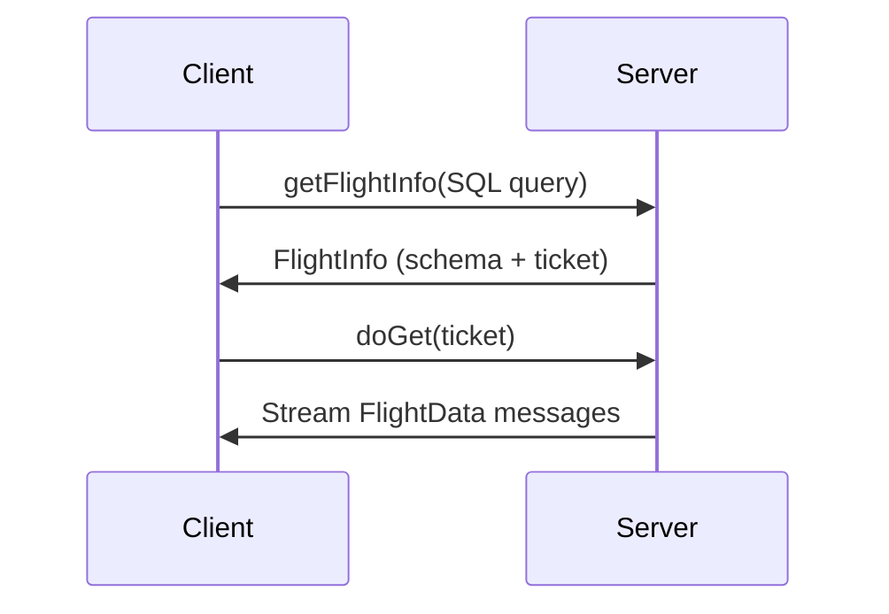

The Arrow Flight transport provides a high-performance gRPC interface for executing SQL queries against blockchain data. It supports both batch and streaming query modes, returning results in Apache Arrow columnar format.

## Overview

Arrow Flight is Apache Arrow's RPC framework designed for high-performance data transfer. It's the recommended transport for:

- Production workloads requiring maximum throughput
- Streaming queries with real-time updates
- Applications that can consume Arrow data directly
- Large result sets with efficient memory usage

### Key Features

- **gRPC-based** - Uses HTTP/2 for efficient multiplexing and streaming
- **Columnar format** - Apache Arrow's in-memory columnar format for zero-copy reads
- **Streaming support** - Continuous query execution with incremental results
- **Schema metadata** - Rich type information included with results

## Server Configuration

The Arrow Flight endpoint runs on port **1602** by default.

### Default Setup

```bash
ampd server
# Arrow Flight available at: localhost:1602
```

### Custom Port Configuration

```toml .amp/config.toml
flight_addr = "0.0.0.0:1602"
```

Or via environment variable:

```bash
export AMP_CONFIG_FLIGHT_ADDR="0.0.0.0:1602"
ampd server
```

### Flight-Only Mode

Run only the Arrow Flight endpoint:

```bash
ampd server --flight-server
```

## Request Flow

Arrow Flight uses a two-step process for query execution:

1. **getFlightInfo** - Submit SQL query, receive metadata and ticket
2. **doGet** - Use ticket to retrieve results as streaming data



### FlightInfo Metadata

The `FlightInfo` response contains:

- **Schema** - Arrow schema describing result columns and types
- **Ticket** - Opaque token for retrieving results via `doGet`
- **Endpoints** - List of servers that can provide the data

### FlightData Streaming

Each `FlightData` message contains:

- **RecordBatch** - Columnar data in Arrow format
- **app_metadata** - Optional metadata (used for streaming queries)

## Client Examples

### Python (pyarrow)

Python's `pyarrow` library provides excellent Arrow Flight support.

#### Installation

```bash
pip install pyarrow
```

#### Basic Query

```python
import pyarrow.flight as flight

# Connect to server
client = flight.connect("grpc://localhost:1602")

# Get flight info with SQL query
info = client.get_flight_info(
    flight.FlightDescriptor.for_command(
        b"SELECT * FROM eth_rpc.blocks LIMIT 10"
    )
)

# Retrieve results
reader = client.do_get(info.endpoints[0].ticket)
table = reader.read_all()

# Convert to pandas DataFrame
df = table.to_pandas()
print(df)
```

#### Streaming Query

```python
import pyarrow.flight as flight

client = flight.connect("grpc://localhost:1602")

# Enable streaming with SETTINGS clause
info = client.get_flight_info(
    flight.FlightDescriptor.for_command(
        b"SELECT * FROM eth_rpc.blocks SETTINGS stream = true"
    )
)

reader = client.do_get(info.endpoints[0].ticket)

# Process batches as they arrive
for batch in reader:
    print(f"Received {batch.data.num_rows} rows")
    # Process batch.data (Arrow RecordBatch)
```

#### Using Headers

You can override streaming mode using the `amp-stream` header:

```python
import pyarrow.flight as flight

client = flight.connect("grpc://localhost:1602")

# Enable streaming via header (alternative to SETTINGS)
headers = [(b"amp-stream", b"true")]

info = client.get_flight_info(
    flight.FlightDescriptor.for_command(
        b"SELECT * FROM eth_rpc.blocks"
    ),
    options=flight.FlightCallOptions(headers=headers)
)

reader = client.do_get(info.endpoints[0].ticket)
for batch in reader:
    print(f"Received {batch.data.num_rows} rows")
```

### Rust (arrow-flight)

Rust applications can use the `arrow-flight` crate.

#### Dependencies

```toml Cargo.toml
[dependencies]
arrow-flight = "53.0"
tokio = { version = "1", features = ["full"] }
```

#### Basic Query

```rust
use arrow_flight::flight_service_client::FlightServiceClient;
use arrow_flight::FlightDescriptor;

#[tokio::main]
async fn main() -> Result<(), Box<dyn std::error::Error>> {
    // Connect to server
    let mut client = FlightServiceClient::connect("http://localhost:1602").await?;

    // Create query descriptor
    let descriptor = FlightDescriptor::new_cmd(
        "SELECT * FROM eth_rpc.blocks LIMIT 10".as_bytes().to_vec()
    );

    // Get flight info
    let flight_info = client.get_flight_info(descriptor).await?.into_inner();
    
    // Get ticket from first endpoint
    let ticket = flight_info.endpoint[0].ticket.clone().unwrap();
    
    // Execute query and get stream
    let mut stream = client.do_get(ticket).await?.into_inner();

    // Read batches
    while let Some(batch) = stream.message().await? {
        println!("Received flight data");
        // Process batch
    }

    Ok(())
}
```

## Query Modes

### Batch Queries

Default mode - query runs once and returns complete results:

```python
info = client.get_flight_info(
    flight.FlightDescriptor.for_command(
        b"SELECT * FROM eth_rpc.blocks WHERE block_num > 18000000 LIMIT 100"
    )
)

reader = client.do_get(info.endpoints[0].ticket)
table = reader.read_all()  # Complete result set
```

### Streaming Queries

Continuous execution with incremental results:

```python
info = client.get_flight_info(
    flight.FlightDescriptor.for_command(
        b"SELECT * FROM eth_rpc.blocks SETTINGS stream = true"
    )
)

reader = client.do_get(info.endpoints[0].ticket)
for batch in reader:
    # Process each batch as new blocks arrive
    print(f"Block range: {batch.data['block_num']}")
```

See [Streaming](/querying/streaming) for detailed streaming query documentation.

## Headers

Arrow Flight supports custom headers for request metadata:

| Header | Type | Description |
|--------|------|-------------|
| `amp-stream` | `true` or `1` | Override streaming mode |
| `amp-resume` | JSON object | Resume streaming from cursor |

### Resume Header Example

```python
import json

cursor = {
    "eth": {
        "block_number": 18001000,
        "hash": "0x..."
    }
}

headers = [
    (b"amp-stream", b"true"),
    (b"amp-resume", json.dumps(cursor).encode())
]

info = client.get_flight_info(
    flight.FlightDescriptor.for_command(b"SELECT * FROM eth_rpc.blocks"),
    options=flight.FlightCallOptions(headers=headers)
)
```

## Streaming Metadata

For streaming queries, `FlightData.app_metadata` contains block range information:

```json
{
  "ranges": [
    {
      "network": "eth",
      "numbers": { "start": 100, "end": 102 },
      "hash": "0x..."
    }
  ],
  "ranges_complete": true
}
```

This metadata helps track query progress and handle blockchain reorganizations.

## Verifying Connection

Check if the Arrow Flight server is running:

```bash
# Using grpcurl
grpcurl -plaintext localhost:1602 list

# Expected output:
arrow.flight.protocol.FlightService
```

## Performance Tips

<AccordionGroup>
  <Accordion title="Use columnar processing">
    Arrow's columnar format enables efficient SIMD operations. Process entire columns rather than individual rows when possible.
  </Accordion>
  
  <Accordion title="Batch size tuning">
    For streaming queries, adjust `server_microbatch_max_interval` to control batch sizes:
    
    ```toml
    server_microbatch_max_interval = 100  # blocks per batch
    ```
  </Accordion>
  
  <Accordion title="Connection pooling">
    Reuse Flight clients across queries to avoid connection overhead.
  </Accordion>
  
  <Accordion title="Schema caching">
    Cache Arrow schemas from `FlightInfo` to avoid repeated schema parsing.
  </Accordion>
</AccordionGroup>

## Limitations

- **Arrow format only** - Results are always Apache Arrow RecordBatches
- **gRPC transport** - Requires gRPC client library support
- **Schema required** - Client must handle Arrow schema for data interpretation
- **Binary data** - Not human-readable without conversion

## Next Steps

<CardGroup cols={2}>
  <Card title="SQL Basics" icon="database" href="/querying/sql-basics">
    Learn SQL syntax and query patterns
  </Card>
  
  <Card title="Streaming" icon="wave" href="/querying/streaming">
    Set up real-time streaming queries
  </Card>
  
  <Card title="JSON Lines" icon="code" href="/querying/json-lines">
    Alternative HTTP/JSON interface
  </Card>
</CardGroup>
