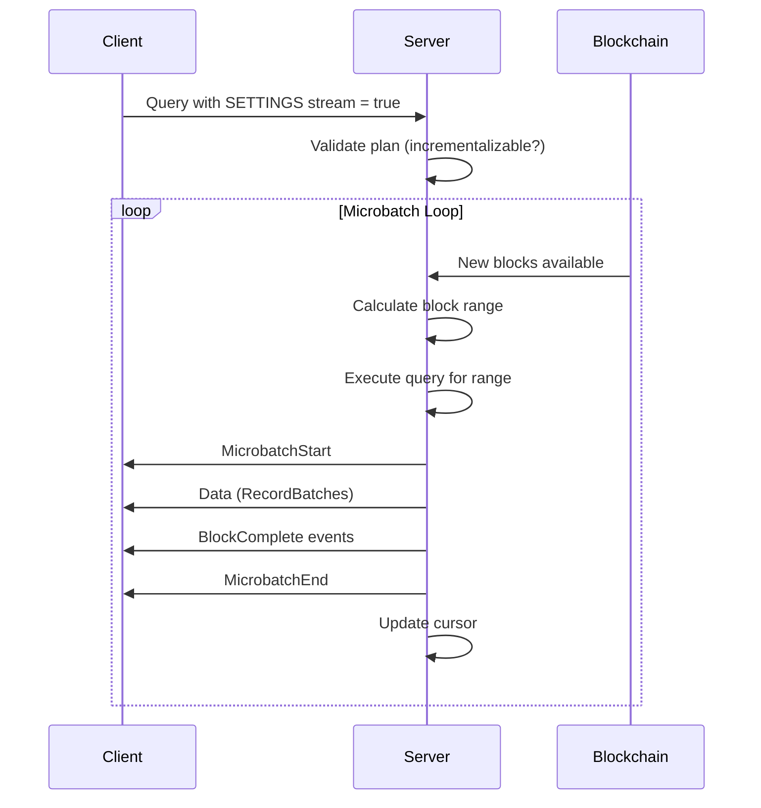

Streaming queries enable real-time, continuous data delivery as new blockchain blocks arrive. Unlike batch queries that execute once and return, streaming queries run in a loop, processing data in discrete microbatches bounded by block ranges.

## Overview

Streaming queries provide:

- **Real-time updates** - Results delivered as new blocks arrive
- **Microbatch processing** - Data processed in bounded block ranges
- **Resumable streams** - Continue from last position after disconnection
- **Reorg handling** - Automatic detection and recovery from blockchain reorganizations

<Warning>
Streaming queries are **only available via Arrow Flight**. The JSON Lines endpoint does not support streaming.
</Warning>

## Enabling Streaming

### Using SETTINGS Clause

Add `SETTINGS stream = true` to any query:

```sql
SELECT block_num, hash, timestamp
FROM eth_rpc.blocks
SETTINGS stream = true
```

### Using amp-stream Header

Alternatively, use the `amp-stream` header (Arrow Flight only):

```python
import pyarrow.flight as flight

client = flight.connect("grpc://localhost:1602")

headers = [(b"amp-stream", b"true")]

info = client.get_flight_info(
    flight.FlightDescriptor.for_command(
        b"SELECT * FROM eth_rpc.blocks"
    ),
    options=flight.FlightCallOptions(headers=headers)
)

reader = client.do_get(info.endpoints[0].ticket)
for batch in reader:
    print(f"Received {batch.data.num_rows} rows")
```

## Microbatch Processing

Streaming queries process data in **microbatches** - discrete units bounded by block ranges.

### Key Concepts

- **Microbatch** - A discrete unit of execution processing blocks from `start` to `end`
- **Block Range** - The `[start, end]` interval of block numbers in a microbatch
- **Delta** - New data arriving in the current microbatch
- **History** - Previously processed data from earlier microbatches
- **Cursor** - Checkpoint containing last processed block number and hash

### Execution Flow



## Message Protocol

Streaming queries emit four types of messages:

| Message | Description |
|---------|-------------|
| `MicrobatchStart` | Signals start of a microbatch with block range and reorg flag |
| `Data` | Arrow RecordBatch containing query results |
| `BlockComplete` | Emitted when all data for a specific block has been sent |
| `MicrobatchEnd` | Signals completion of current microbatch |

### Message Sequence Example

```
MicrobatchStart { range: 100..=102, is_reorg: false }
  Data(batch_1)          # Rows from blocks 100-101
  BlockComplete(100)     # All data for block 100 sent
  Data(batch_2)          # Rows from block 101-102
  BlockComplete(101)     # All data for block 101 sent
  BlockComplete(102)     # All data for block 102 sent
MicrobatchEnd { range: 100..=102 }

MicrobatchStart { range: 103..=105, is_reorg: false }
  Data(batch_3)
  BlockComplete(103)
  ...
```

## Configuration

Configure streaming behavior in `.amp/config.toml`:

```toml .amp/config.toml
# Maximum blocks per microbatch
server_microbatch_max_interval = 100

# Keep-alive interval in seconds (minimum 30s)
keep_alive_interval = 60
```

### Settings Reference

| Setting | Default | Description |
|---------|---------|-------------|
| `server_microbatch_max_interval` | - | Maximum blocks per streaming microbatch |
| `keep_alive_interval` | - | Seconds between keep-alive messages (min 30s) |

### Keep-Alive Messages

During periods with sparse data or slow block production, the server emits empty RecordBatches at the configured interval to prevent client timeouts:

```python
for batch in reader:
    if batch.data.num_rows == 0:
        print("Keep-alive message (no new data)")
    else:
        print(f"Received {batch.data.num_rows} rows")
```

## Resuming Streams

Clients can resume a stream after disconnection using cursors.

### Saving Cursor

Extract cursor from `MicrobatchEnd` metadata:

```python
for batch in reader:
    # Check for microbatch end metadata
    if batch.app_metadata:
        metadata = json.loads(batch.app_metadata.decode('utf-8'))
        if 'cursor' in metadata:
            # Save cursor for resumption
            saved_cursor = metadata['cursor']
```

### Resuming with Cursor

Provide cursor via `amp-resume` header:

```python
import json

cursor = {
    "eth": {
        "block_number": 18001000,
        "hash": "0x..."
    }
}

headers = [
    (b"amp-stream", b"true"),
    (b"amp-resume", json.dumps(cursor).encode())
]

info = client.get_flight_info(
    flight.FlightDescriptor.for_command(
        b"SELECT * FROM eth_rpc.blocks"
    ),
    options=flight.FlightCallOptions(headers=headers)
)

# Stream continues from cursor.block_number + 1
reader = client.do_get(info.endpoints[0].ticket)
```

## Blockchain Reorganization Handling

Streaming queries automatically detect and recover from blockchain reorganizations (reorgs).

### Reorg Detection

When a cursor's hash doesn't match the canonical chain:

1. Server walks backwards to find common ancestor block
2. Next microbatch is flagged with `is_reorg: true`
3. Results from reorg base are recomputed with new canonical data

### Client Response to Reorgs

```python
for batch in reader:
    if batch.app_metadata:
        metadata = json.loads(batch.app_metadata.decode('utf-8'))
        
        if metadata.get('is_reorg'):
            print("⚠️ Blockchain reorganization detected!")
            print(f"Recomputing from block {metadata['range']['start']}")
            # Invalidate cached data from affected blocks
            cache.invalidate_from(metadata['range']['start'])
    
    # Process data
    process_batch(batch.data)
```

<Note>
Clients receiving `is_reorg: true` should invalidate cached data from affected blocks and reprocess.
</Note>

## Streaming Metadata

For streaming queries, `FlightData.app_metadata` contains block range information:

```json
{
  "ranges": [
    {
      "network": "eth",
      "numbers": { "start": 100, "end": 102 },
      "hash": "0x...",
      "prev_hash": "0x..."
    }
  ],
  "ranges_complete": true,
  "is_reorg": false
}
```

This metadata helps:

- Track query progress
- Handle blockchain reorganizations
- Build cursors for resumption
- Monitor data freshness

## Limitations

Streaming queries require all operations to be **incrementalizable** - capable of execution in discrete microbatches without maintaining cross-batch state.

### Unsupported Operations

The following operations prevent incrementalization and will be **rejected**:

- **Aggregate functions** (COUNT, SUM, AVG, etc.) - Require running state
- **DISTINCT** - Requires global deduplication state
- **LIMIT** - Requires counting across batches
- **ORDER BY** (global) - Requires seeing all data before sorting
- **Window functions** - Often require state and sorting
- **Recursive queries** - Inherently stateful

### Supported Operations

Streaming queries support:

- **SELECT** with projections
- **WHERE** filtering
- **JOIN** operations
- **UDFs** (user-defined functions)
- **Subqueries** (if incrementalizable)

### Example: Non-Incrementalizable Query

```sql
-- ❌ REJECTED: Uses COUNT aggregate
SELECT COUNT(*) as total_blocks
FROM eth_rpc.blocks
SETTINGS stream = true
```

Error: `NonIncrementalOp: Aggregate function COUNT requires maintaining state across batches`

### Example: Incrementalizable Query

```sql
-- ✅ ACCEPTED: Simple filtering and projection
SELECT block_num, hash, gas_used
FROM eth_rpc.blocks
WHERE gas_used > 10000000
SETTINGS stream = true
```

## Complete Python Example

```python
import pyarrow.flight as flight
import json
from typing import Optional

class StreamingQueryClient:
    def __init__(self, host: str = "localhost", port: int = 1602):
        self.client = flight.connect(f"grpc://{host}:{port}")
        self.cursor: Optional[dict] = None
    
    def stream_query(self, sql: str):
        """Execute streaming query and process results."""
        headers = [(b"amp-stream", b"true")]
        
        # Add resume cursor if available
        if self.cursor:
            headers.append((b"amp-resume", json.dumps(self.cursor).encode()))
        
        info = self.client.get_flight_info(
            flight.FlightDescriptor.for_command(sql.encode()),
            options=flight.FlightCallOptions(headers=headers)
        )
        
        reader = self.client.do_get(info.endpoints[0].ticket)
        
        for batch in reader:
            # Check for metadata
            if batch.app_metadata:
                metadata = json.loads(batch.app_metadata.decode('utf-8'))
                
                # Handle reorgs
                if metadata.get('is_reorg'):
                    print(f"⚠️ Reorg detected at block {metadata['range']['start']}")
                    self.handle_reorg(metadata['range'])
                
                # Update cursor
                if 'cursor' in metadata:
                    self.cursor = metadata['cursor']
            
            # Process data
            if batch.data.num_rows > 0:
                self.process_batch(batch.data)
            else:
                print("Keep-alive (no new data)")
    
    def process_batch(self, record_batch):
        """Process Arrow RecordBatch."""
        df = record_batch.to_pandas()
        for _, row in df.iterrows():
            print(f"Block {row['block_num']}: {row['hash']}")
    
    def handle_reorg(self, range_info):
        """Handle blockchain reorganization."""
        print(f"Invalidating data from block {range_info['start']}")
        # Implement cache invalidation logic

# Usage
client = StreamingQueryClient()
client.stream_query("""
    SELECT block_num, hash, gas_used
    FROM eth_rpc.blocks
    WHERE gas_used > 10000000
""")
```

## Batch vs Streaming Comparison

| Aspect | Batch | Streaming |
|--------|-------|----------|
| **Activation** | Default | `SETTINGS stream = true` |
| **Execution** | Single execution | Continuous loop |
| **Results** | Complete set returned | Incremental updates |
| **SQL Support** | Full (any operation) | Limited (incrementalizable only) |
| **State** | Stateless | Tracks cursor and watermarks |
| **Use Case** | Ad-hoc queries, reports | Real-time feeds, monitoring |
| **Transport** | Flight or JSONL | Flight only |

## Next Steps

<CardGroup cols={2}>
  <Card title="Arrow Flight" icon="bolt" href="/querying/arrow-flight">
    Required transport for streaming queries
  </Card>
  
  <Card title="SQL Basics" icon="database" href="/querying/sql-basics">
    Learn which SQL operations are incrementalizable
  </Card>
  
  <Card title="Overview" icon="book" href="/querying/overview">
    Return to querying overview
  </Card>
</CardGroup>
